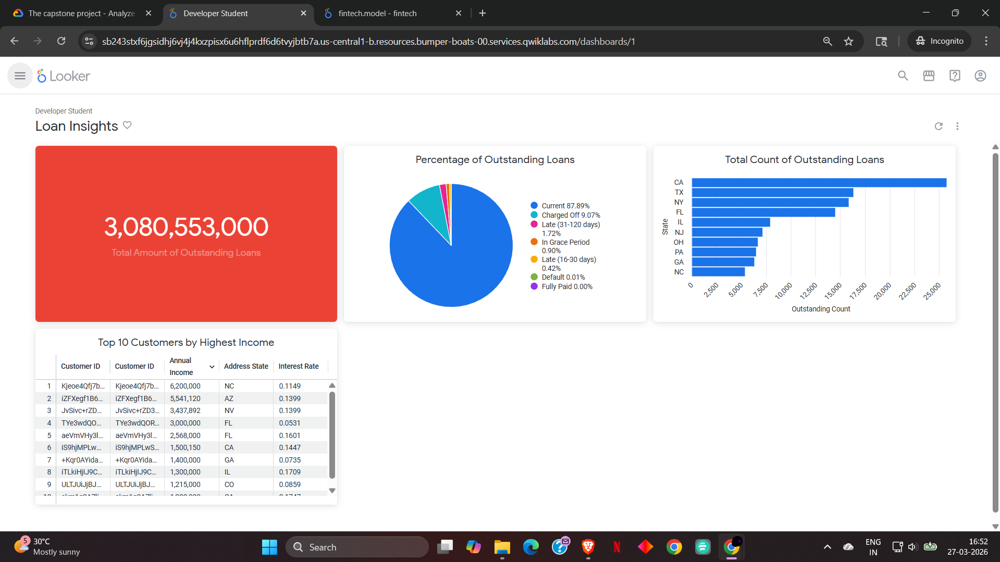
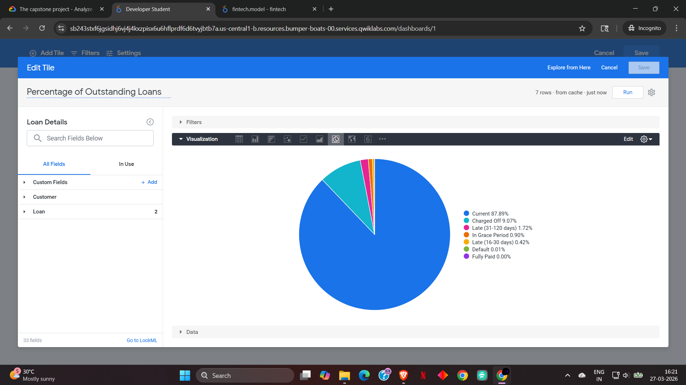
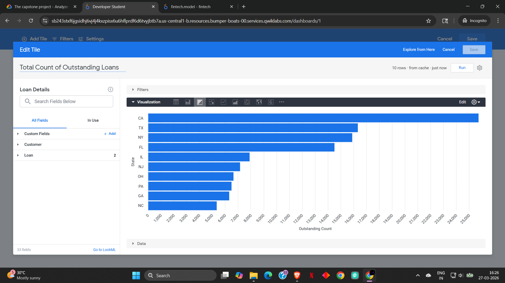
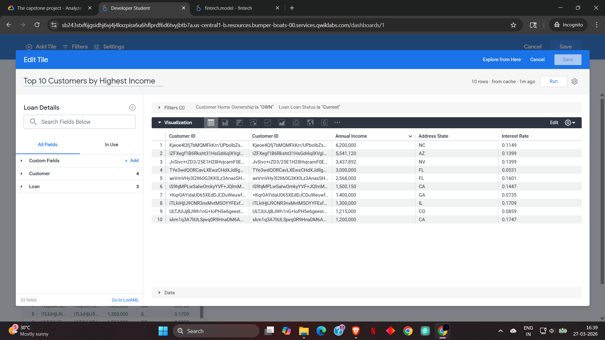
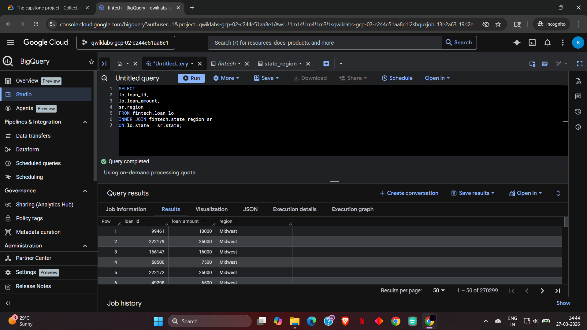
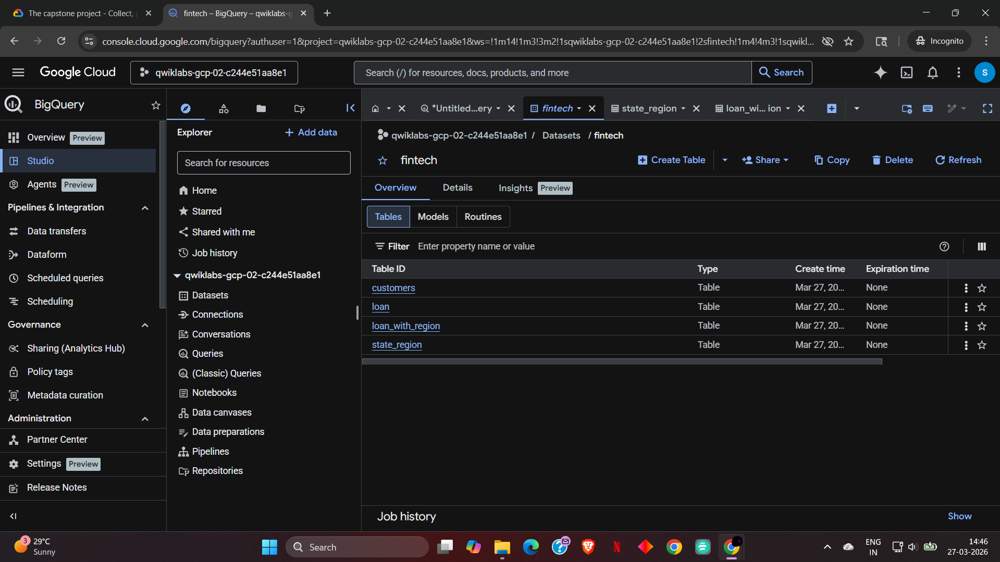

# Loan Data Analytics Dashboard  
### End-to-End Cloud Data Analytics Project (Google Cloud Platform)

---

## 📌 Overview
This project demonstrates a complete cloud-based data analytics workflow using Google Cloud Platform. It focuses on analyzing loan data to generate actionable insights and presenting them through an interactive dashboard for business decision-making.

---

## 🛠️ Tech Stack
- **Google BigQuery** – Data warehousing and querying  
- **SQL** – Data cleaning, transformation, and analysis  
- **Looker** – Data visualization and dashboard development  
- **Google Sheets** – Data preview and quick analysis  

---

## 📂 Dataset
The dataset includes key financial and customer-related attributes:
- Loan amount and status  
- Customer income  
- State and regional classification  
- Loan purpose  

---

## ⚙️ Project Workflow

### 1. Data Preparation
- Structured raw data into relational tables
- Cleaned and validated datasets using SQL

### 2. Data Transformation
- Performed joins between loan and regional datasets
- Created derived tables for analytical use

### 3. Data Analysis
- Aggregated loan metrics (counts, totals, distributions)
- Identified patterns across regions and customer segments

### 4. Data Visualization
- Built an interactive dashboard using Looker
- Designed visuals for business-level insights

---

## 📊 Dashboard Preview

### 🔹 Final Dashboard

---

### 🔹 Loan Status Distribution

---

### 🔹 State-wise Loan Distribution

---

### 🔹 Top Customers by Income

---

## 🧠 Key Analysis

### 🔹 BigQuery Join Results

---

### 🔹 Dataset Overview

---

## 📈 Key Insights
- Majority of loans are in **Current status (~87%)**, indicating strong repayment trends  
- Loan distribution is highly concentrated in key states such as **California and Texas**  
- High-income customers tend to have **better loan conditions and lower risk**  
- A small percentage of loans fall into **late or charged-off categories**, highlighting risk segments  

---

## 🎯 Business Impact
This dashboard enables stakeholders to:
- Monitor loan portfolio performance  
- Identify high-risk loan segments  
- Analyze regional trends  
- Support data-driven financial decisions  

---

## 📌 Future Enhancements
- Implement predictive models for loan default risk  
- Integrate real-time data pipelines  
- Enhance dashboard interactivity and filtering  

---

## 👤 Author
**Srikar**  
Aspiring Cloud Data Analyst  
